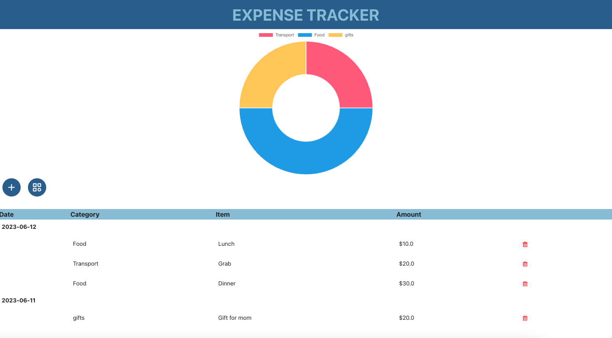

# Expense Tracker 
This is an Expense Tracker application built using React.js, Java Spring Boot, and MySQL. The application allows users to track their expenses, categorize them, and view expenses by category in a doughnut chart. It provides a convenient way to manage personal finances.



# Features
- Expense Management: Users can add, edit, and delete expenses. Each expense can be associated with a specific month and category.

- Categorization: Expenses can be categorized into different categories such as groceries, transportation, entertainment, etc. Users can choose a category for each expense to better organize their spending.

- Doughnut Chart: The expense tracker provides a visual representation of expenses by category using a doughnut chart. Users can quickly identify the distribution of their expenses across different categories.

# Technologies used
The Expense Tracker project utilizes the following technologies:

- React.js: A JavaScript library for building user interfaces. React.js is used to create the frontend of the application, including the user interface components and interactions.

- Java Spring Boot: A Java framework for building web applications. Spring Boot is used to develop the backend API for handling CRUD operations and business logic.

- MySQL: A popular open-source relational database management system. MySQL is used as the database to store expense data, including categories, months, and expenses.

# Installation
To set up the Expense Tracker application locally, follow these steps:

1. Clone this repository
2. Set up the backend:
  - Ensure that Java and Maven are installed on your system.
  - Configure the MySQL database connection in the application.properties file.
  - Run the Spring Boot application: ```mvn spring-boot:run```
3. Set up the frontend:
  - Ensure that Node.js and npm (Node Package Manager) are installed on your system.
  - Navigate to the frontend directory: ```cd app```
  - Install the dependencies: ```npm install```
  - Start the development server: ```npm start```
 4. Access the Expense Tracker application 

# Usage
Once the application is set up and running, you can perform the following actions:

- Add a new expense by specifying the amount, category, and month.
- Edit or delete existing expenses.
- Categorize expenses into predefined categories.
- Visualize expense distribution by category using the doughnut chart.
